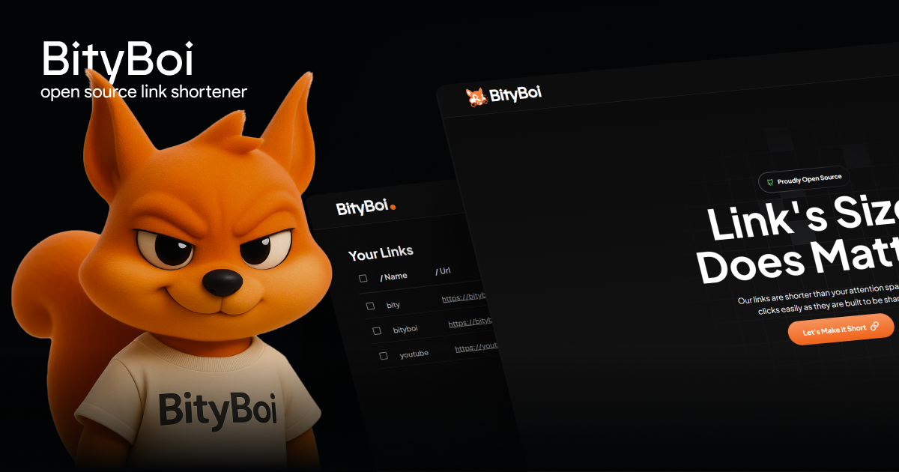

# BITYBOI



*Shorten links, amplify engagement, simplify sharing.*


### Built with the tools and technologies:


---

## Table of Contents

- [Overview](#overview)
- [Getting Started](#getting-started)
  - [Prerequisites](#prerequisites)
  - [Installation](#installation)
  - [Usage](#usage)
  - [Testing](#testing)

---

## Overview

**Bityboi** is a powerful developer tool designed to streamline link management and user authentication in web applications.

### Why Bityboi?

This project empowers developers to create efficient applications with robust link management and secure user authentication. The core features include:

- 🔗 **Django-based Backend:** Provides a reliable framework for scalable application development.
- 🔒 **User Authentication:** Simplifies user management with Google OAuth2 and secure password resets.
- 📏 **Link Management:** Efficiently handles user-generated shortened URLs for easy tracking.
- 🎨 **Customizable Frontend:** Built with React and Tailwind CSS for a responsive user interface.
- 🔄 **API Integration:** Ensures seamless communication between frontend and backend services.
- ✅ **Testing Framework:** Maintains code reliability and quality through comprehensive testing.

---

## Getting Started

### Prerequisites

This project requires the following dependencies:

- **Programming Language:** JavaScript, Python
- **Package Manager:** pip, npm

### Installation

Build Bityboi from the source and install dependencies:

1. **Clone the repository:**

   ```sh
   git clone https://github.com/Somraj-234/bityboi
   ```

2. **Navigate to the project directory:**

   ```sh
   cd bityboi
   ```

3. **Install the dependencies:**

   Using [pip](https://pypi.org/project/pip/):

   ```sh
   pip install -r backend/requirements.txt
   ```

   Using [npm](https://www.npmjs.com/):

   ```sh
   npm install
   ```

### Usage

Run the project with:

Using pip:

```sh
python backend/manage.py runserver
```

Using npm:

```sh
npm start
```

### Testing

Bityboi uses `pytest` and `Jest` for backend and frontend testing.

Using pip:

```sh
pytest
```

Using npm:

```sh
npm test
```

---

[⬆ Return to top](#bityboi)
